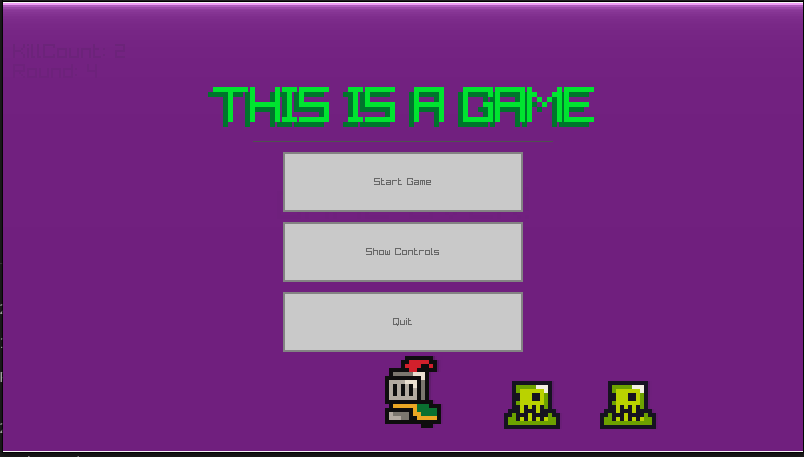
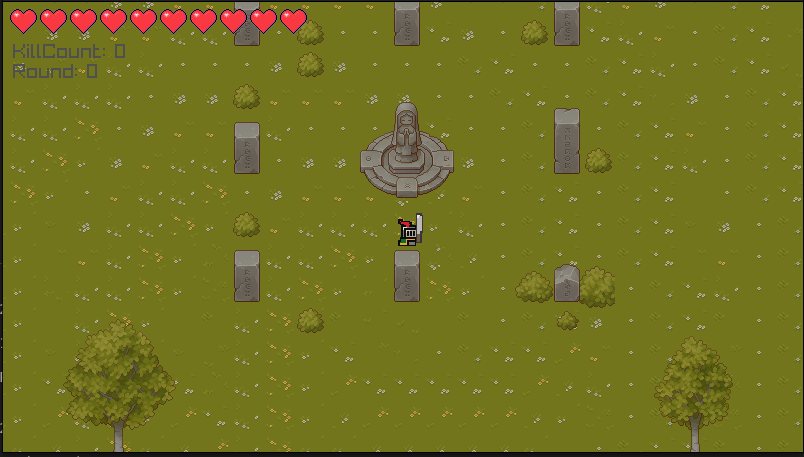
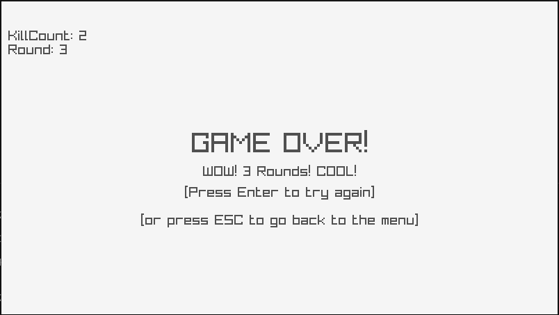
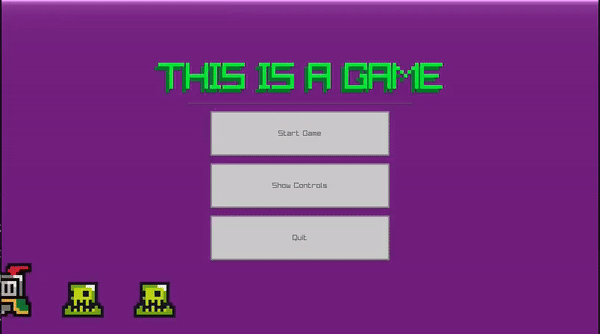
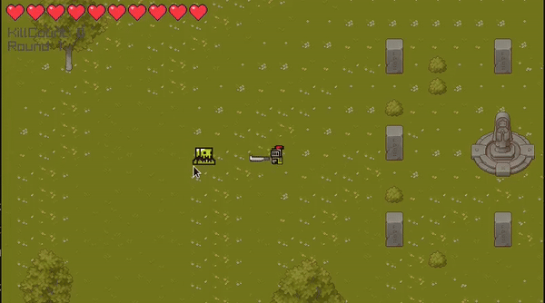

# This is a Game
#### "Or legendary-journey(Github generated that name...)"

## Table of Contents
- [About the Game](#about-the-game)
- [Gameplay](#gameplay)
  - [Controls](#controls)
  - [How to Play](#how-to-play)
- [Installation](#installation)
- [Screenshots & GIFs](#screenshots--gifs)
- [Gameplay Video](#gameplay-video)
- [Credits](#credits)
- [License](#license)
- [Future Updates](#future-updates)

## About the Game
"This is a Game" is a simple 2D game where you play as a knight armed with a machete, fending off endless waves of slime attacks. Survive as long as you can while slashing through hordes of enemies in this fast-paced survival game.

## Gameplay

### Controls
- **W = up,A = left.S = down,D = right**: Move your character
- **Left Click**: Attack with your machete
- **M**: Pause or unpause the music

### How to Play
Your objective is simple: **Don't die**. Survive as many rounds as you can by defeating all the slimes that come your way. The longer you survive, the tougher the slimes become. Use your machete to slay them and stay alive!

## Installation
To play "This is a Game", follow these steps:
1. Clone the repository.
2. make a build directory and jump into build(mkdir build && cd build)
4. run cmake(cmake ..)
5. Then run make (make)
6. Then the exe (./main)
7. PLay the game :)

## Screenshots & GIFs
Here's a glimpse of the action:

### Screenshots

### GIFs

## Gameplay Video
Want to see the game in action? Check out the gameplay video below:

## Credits
- **Sprites**: [HEARTS](https://skristi.itch.io/heart-and-health-bars),[Player & Slimes](www.google.com), [World and props design](www.goggle.com),[Machete](www.google.com), Will add more links to creator, but something is wrong with itch.io. So can't access there pages. //I linked it to google for now.
- **Music**: [K-nutting](https://soundcloud.com/knut-lyv-n/k-nutting))
- **Development**: Made using [raylib](https://www.raylib.com/), [raygui](https://github.com/raysan5/raygui), [raylib-tileson](https://github.com/RobLoach/raylib-tileson), [nlohmann_json](https://github.com/nlohmann/json), Cmake and C++

## License
This project is open-source and available under the MIT License. Feel free to use the code in your own projects.

## Future Updates
"This is a Game" is a foundational project that I plan to expand upon in the future. The current version is rounds-based, offering a simple gameplay experience. In the future, I aim to add more features, enemies, levels, and story elements to create a more comprehensive game.

For now, I'm focusing on other projects, but stay tuned for updates in the future!

---

Thanks for checking out "This is a Game"! Feel free to contribute or reach out with any feedback.
